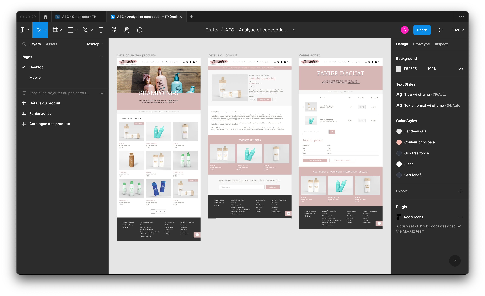

# Description 

Petit projet que j'ai réalisé dans le cadre de mon AEC en développement web. 
Il s'agissait de faire un graphisme simple pour quelques pages d'un salon de coiffure dans le cadre de mon cours d'analyse et conception.  

## Table des matières

1. [Visuels](#visuels)
2. [Prototype Figma](#prototype-figma)

# Visuels

# Prototype Figma 

[Consulter le prototype Figma du projet](https://www.figma.com/proto/jUGWP1sTSVkPVduAYsuUTc/AEC---Analyse-et-conception---TP-(Aminata)?page-id=0%3A1&node-id=307%3A9&viewport=100%2C638%2C0.14&scaling=scale-down-width)

 
